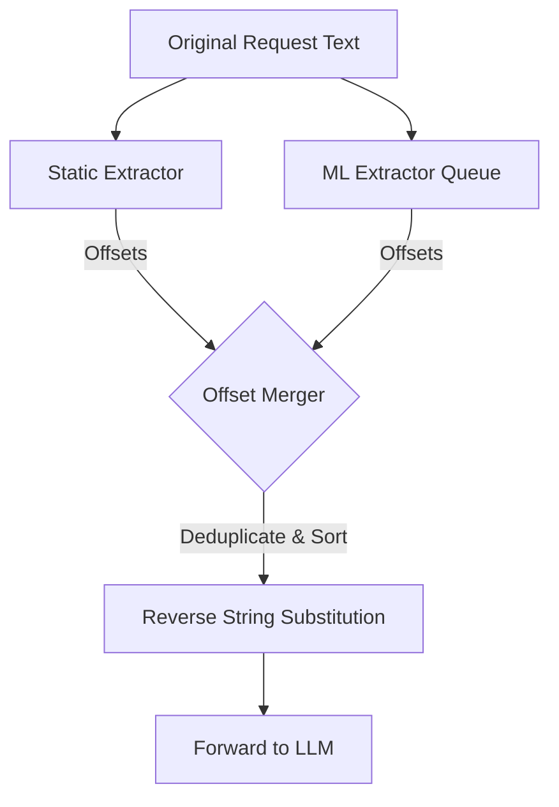

# Redaction Engine

The AI DLP Proxy uses an **Advanced Parallel Redaction Engine** to ensure maximum performance, contextual accuracy, and exact token counting when sanitizing sensitive data.

## How it Works

The redaction process leverages two simultaneous extraction strategies, followed by a smart offset-merging algorithm.

### 1. Static Extraction (Fast)
The first layer uses **FlashText**, an algorithm optimized for matching keywords in a single pass.
- **Purpose**: Detects known secrets (API keys, specific project codenames, internal tokens).
- **Source**: Keywords are loaded from `terms.txt` or HashiCorp Vault.
- **Performance**: Extremely fast (microseconds), independent of the number of keywords.
- **Output**: Returns character offsets (e.g., `(10, 20, "STATIC_TERM")`).

### 2. Machine Learning Extraction (Smart)
The second layer uses **Microsoft Presidio** (backed by SpaCy `en_core_web_sm`).
- **Purpose**: Detects PII (Personally Identifiable Information) that follows patterns or context, such as:
    - Names
    - Phone Numbers
    - Email Addresses
    - Credit Card Numbers
    - Crypto Wallets
- **Performance**: Slower than static (milliseconds). The inference is offloaded to a persistent `asyncio.Queue` handled by dedicated background workers, preventing thread thrashing.
- **Contextual Integrity**: Because it runs on the *original* untouched string, SpaCy's contextual window is 100% preserved.

### 3. Merging and Application
In legacy systems, replacing text sequentially corrupts the string indices and context for subsequent models. AI DLP Proxy solves this via:
1. **Overlap Resolution**: Offsets from both extractors are merged and sorted. Overlapping spans are combined in `O(N log N)` time.
2. **Reverse Application**: The `[REDACTED]` tokens are applied to the string backwards (from end to start), guaranteeing that early replacements do not shift the index offsets of later replacements.

## Flow Diagram

