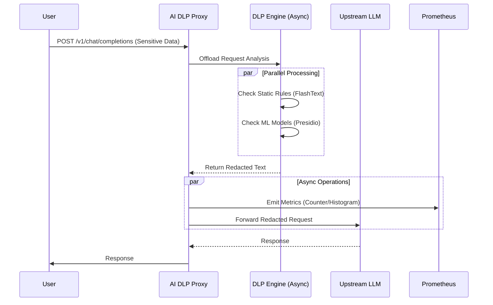

# Architecture

The AI DLP Proxy is designed as a high-performance, asynchronous gateway that sits between your users (or applications) and external LLM providers.

## Sequence Diagram

The following diagram illustrates the request flow, highlighting the parallel execution of static and ML analysis.

## Core Components

### 1. Proxy Core (`mitmproxy`)
The foundation is `mitmproxy`, a robust, interactive HTTPS proxy. It handles:
- **SSL/TLS Termination**: Decrypts traffic to inspect the payload.
- **Connection Management**: Handles client and server connections efficiently.
- **Addon Mechanism**: Allows us to inject custom logic (`DLPAddon`) into the request lifecycle.

### 2. DLP Engine
The brain of the operation. It uses a hybrid approach:
- **Static Analysis**: Uses `FlashText` for O(1) keyword replacement. Ideal for known secrets (API keys, internal codenames).
- **ML Analysis**: Uses `Microsoft Presidio` and `SpaCy` for Named Entity Recognition (NER). Detects dynamic PII like names, locations, and phone numbers.

### 3. Async Processing & Safety
To ensure data safety, the proxy uses a **Fail Closed** model. The main request loop `awaits` the DLP analysis, blocking the request until it is fully sanitized. If the DLP engine fails or times out, the request is rejected (HTTP 500) to prevent data leakage.

However, non-critical operations like metrics collection and file I/O (`StatsManager`) are offloaded to separate threads (`asyncio.to_thread`) to prevent blocking the main event loop.

### 4. Observability
To ensure production readiness, the system exposes real-time metrics:
- **Prometheus**: Scrapes the proxy on port `9090` to collect time-series data (request counts, latency, PII detected).
- **Grafana**: Visualizes these metrics in a user-friendly dashboard, allowing operators to monitor DLP performance and token usage.
