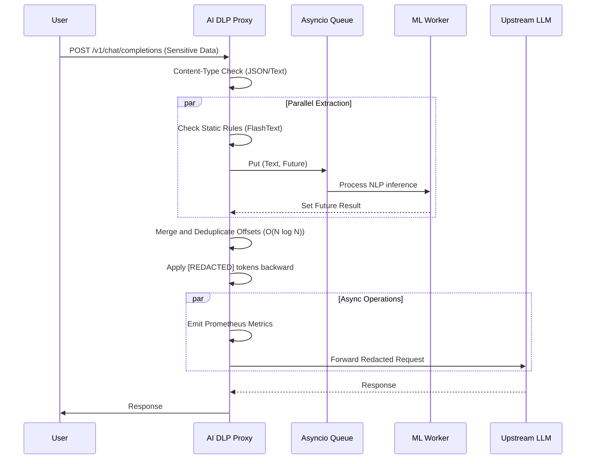

# Architecture

The AI DLP Proxy is designed as a high-performance, asynchronous gateway that sits between your users (or applications) and external LLM providers.

## Sequence Diagram

The following diagram illustrates the request flow, highlighting the `asyncio.Queue` workers and parallel extraction logic.

```mermaid
sequenceDiagram
    participant User
    participant Proxy as AI DLP Proxy
    participant Queue as Asyncio Queue
    participant MLWorker as ML Worker
    participant LLM as Upstream LLM

    User->>Proxy: POST /v1/chat/completions (Sensitive Data)
    Proxy->>Proxy: Content-Type Check (JSON/Text)

    par Parallel Extraction
        Proxy->>Proxy: Check Static Rules (FlashText)
        Proxy->>Queue: Put (Text, Future)
        Queue->>MLWorker: Process NLP inference
        MLWorker-->>Proxy: Set Future Result
    end

    Proxy->>Proxy: Merge and Deduplicate Offsets (O(N log N))
    Proxy->>Proxy: Apply [REDACTED] tokens backward

    par Async Operations
        Proxy->>Proxy: Emit Prometheus Metrics
        Proxy->>LLM: Forward Redacted Request
    end

    LLM-->>Proxy: Response
    Proxy->>User: Response
```

## Core Components

### 1. Proxy Core (`mitmproxy`)
The foundation is `mitmproxy`, a robust, interactive HTTPS proxy. It handles SSL/TLS Termination, connection management, and exposes a hook (`DLPAddon`) to intercept payloads. It now safely ignores binary payloads.

### 2. DLP Engine & Queue
The engine uses an asynchronous bounded queue (`maxsize=1000`) and a fixed number of persistent background workers (default 4).
This bounded worker pool architecture protects the proxy from thread-thrashing and memory exhaustion under high concurrency.
- **Static Analysis**: `FlashText` extracts spans instantly.
- **ML Analysis**: `Microsoft Presidio` via SpaCy (`en_core_web_sm`) is executed by the background workers without blocking the main event loop.

### 3. Smart JSON Payload Processing
Before extraction, the proxy parses the `Content-Type` header. If the payload is `application/json`, it is fully deserialized. The proxy then performs a **recursive asynchronous traversal** of the JSON tree.
It applies NLP extraction *only* to string values, preserving keys, integers, and the structural integrity of the JSON. This ensures that a blacklisted term won't accidentally censor a JSON key like `"model"`, which would return a 400 Bad Request from the LLM API.

### 4. Parallel Redaction & Offset Merging
In previous versions, static analysis was applied before ML, breaking the contextual window of the NLP model.
Now, extraction runs **in parallel** on the pristine original string. Offsets (e.g., `[(5, 12, "PASSWORD"), (8, 15, "PERSON")]`) are collected, merged, deduplicated, and applied backwards. This guarantees 100% contextual accuracy for SpaCy.

### 5. Atomic Secret Reloading
The engine spawns a background `_vault_poller` task that connects to HashiCorp Vault. Every 60 seconds, it fetches the latest secrets and creates a new `KeywordProcessor` in memory. Once ready, it performs an **atomic reference swap**, ensuring zero-downtime key rotation without locking the request pipeline.

### 6. Fail Closed Security
If any component of the proxy crashes, the exception is caught, and the proxy returns a well-formed JSON 500 error (`{"error": {"message": "DLP Policy Violation"}}`), explicitly avoiding opaque upstream parser failures.
