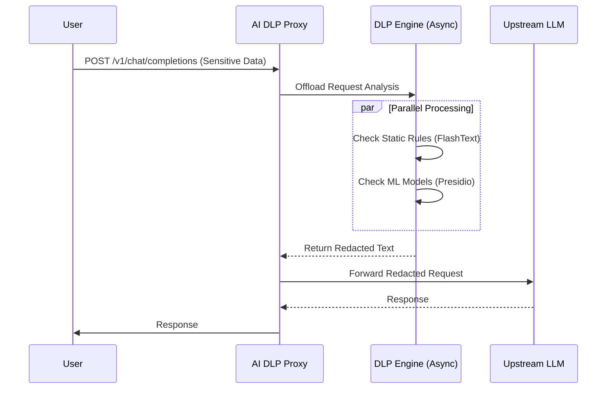

# Architecture

The AI DLP Proxy is designed as a high-performance, asynchronous gateway that sits between your users (or applications) and external LLM providers.

## Sequence Diagram

The following diagram illustrates the request flow, highlighting the parallel execution of static and ML analysis.

## Core Components

### 1. Proxy Core (`mitmproxy`)
The foundation is `mitmproxy`, a robust, interactive HTTPS proxy. It handles:
- **SSL/TLS Termination**: Decrypts traffic to inspect the payload.
- **Connection Management**: Handles client and server connections efficiently.
- **Addon Mechanism**: Allows us to inject custom logic (`DLPAddon`) into the request lifecycle.

### 2. DLP Engine
The brain of the operation. It uses a hybrid approach:
- **Static Analysis**: Uses `FlashText` for O(1) keyword replacement. Ideal for known secrets (API keys, internal codenames).
- **ML Analysis**: Uses `Microsoft Presidio` and `SpaCy` for Named Entity Recognition (NER). Detects dynamic PII like names, locations, and phone numbers.

### 3. Async Processing
To minimize latency, the DLP analysis runs in a separate thread pool (`asyncio.to_thread`). This ensures that the main event loop remains responsive, handling thousands of concurrent connections.
